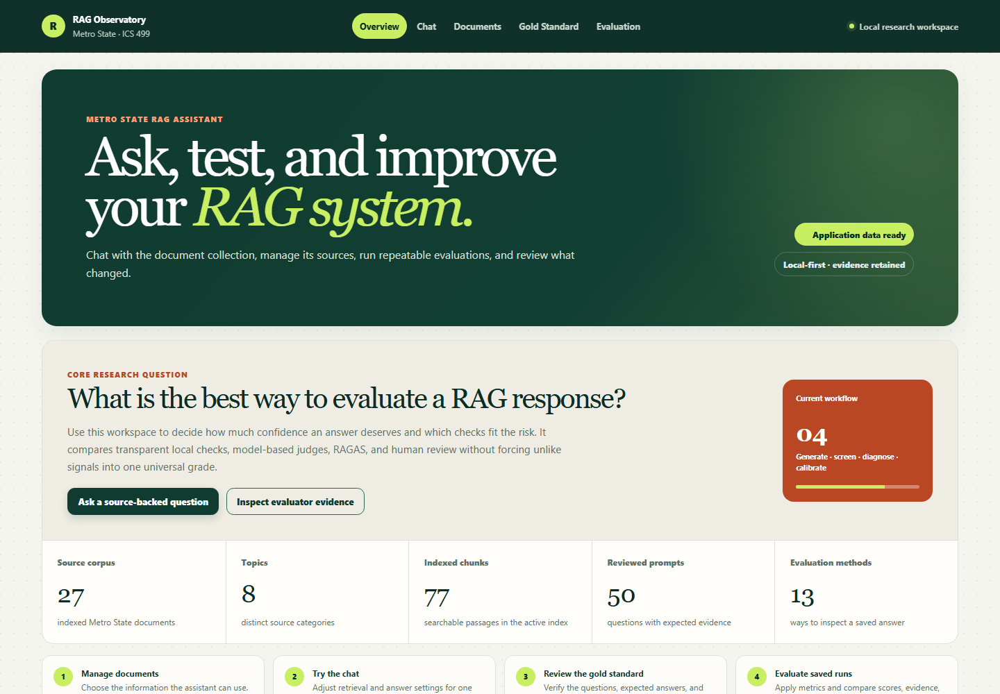
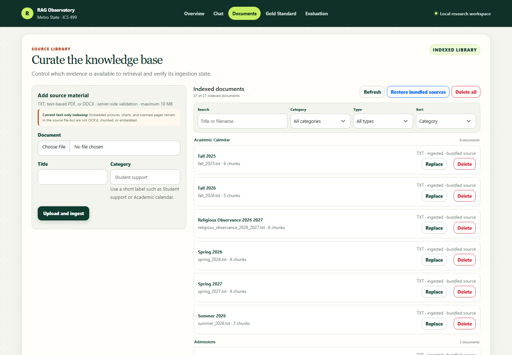
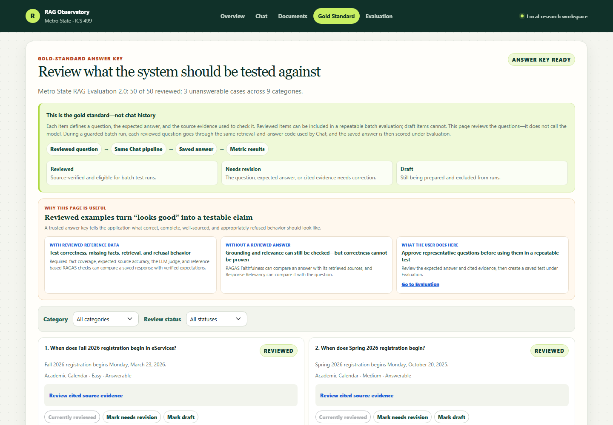
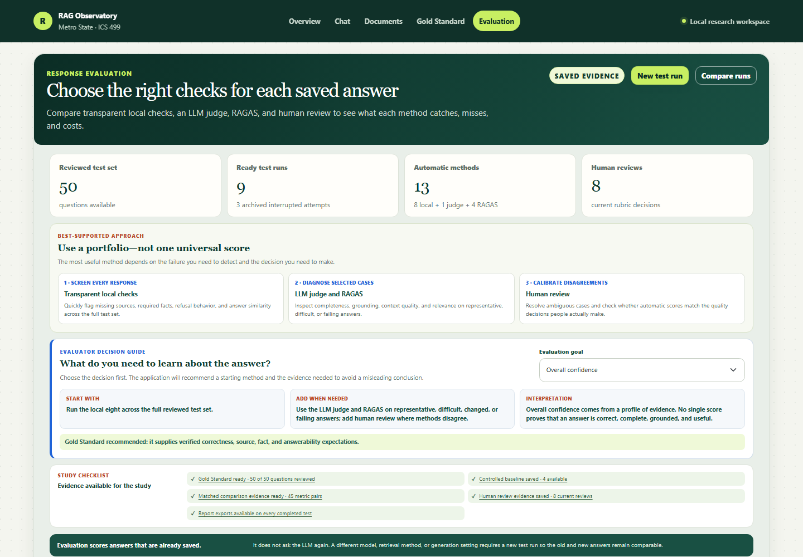
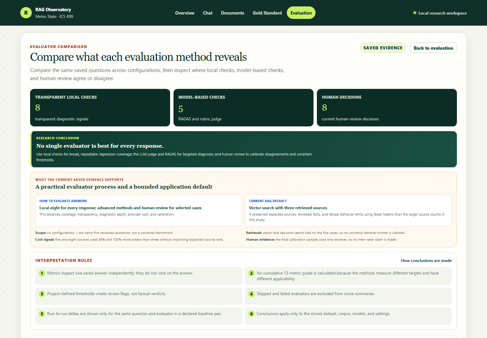

# LLM RAG Evaluation Project

An ICS 499 capstone web application for comparing Retrieval-Augmented
Generation (RAG) configurations and evaluation methods using Metro State
documents.

The application is also a research instrument. Its final purpose is to produce
repeatable evidence about what different RAG evaluation metrics measure, where
they are useful, where they disagree, and how document-collection size and
composition affect retrieval and evaluation results.

The central research question is: **What is the best way to evaluate a RAG
response?** Here, “best” means the most useful evidence for a particular
failure and decision—not one universal evaluator or a combined score. The
implemented workflow uses transparent local checks for broad screening,
LLM-as-judge and RAGAS for targeted diagnosis, and human review to calibrate
ambiguous cases and evaluator disagreements.

## Final Submission Snapshot

| Area | Final repository evidence |
| --- | --- |
| Knowledge base | 27 bundled Metro State documents, 77 baseline chunks, browser TXT/text-based-PDF/DOCX administration, and verified replacement cleanup |
| Answer pipeline | Shared source-grounded Chat/test-run path with vector or keyword retrieval and guarded Gemini generation |
| Gold Standard | 50 reviewed v2.0 questions across nine categories, including three unanswerable cases |
| Evaluation | Eight local metrics, one structured LLM judge, four RAGAS metrics, and a separate human-review rubric |
| Final study | Six controlled conditions, 30 saved responses, portable exports, matched baseline comparisons, and documented generalization limits |
| Quality gates | 70 provider-free tests, PHP/JavaScript/dependency/configuration checks, a seeded MySQL/Chroma/PHP smoke test, and GitHub Actions |

## Start Here for Repository Review

The repository itself contains the final deliverables; a reviewer does not need
the author's local database or private working directory:

- [Final study report](docs/final-study-report.md): design, results, failure
  analysis, recommendations, verification, and limitations.
- [Application-generated final-study evidence](data/evaluation/final-study/README.md):
  six complete JSON exports with checksums.
- [Final presentation outline](docs/final-presentation-outline.md): a concise
  ten-slide narrative and live-demo order.
- [Final presentation script](docs/final-presentation-script.md): complete
  10–12 minute speaker notes, demo cues, and likely-question answers.
- [Evaluation strategy](docs/evaluation-strategy.md): the score contracts and
  controlled comparison rules behind the report.
- [Post-capstone roadmap](docs/post-capstone-roadmap.md): clearly separated
  future multimodal, conversational, multi-user, and agentic research.

A fresh setup rebuilds the source corpus and reviewed Gold Standard, but it
does not silently import historical runtime rows. The tracked JSON exports are
the portable record of the completed final-study runs and can be inspected
directly from GitHub without reproducing paid model calls.



<details>
<summary>Open the current browser interface gallery</summary>

### Documents



### Gold Standard



### Evaluation



### Compare Runs



</details>

The submitted application is intentionally a text-only, single-turn, shared
local research workspace with a fixed retrieve-then-generate answer path. It
does not claim to interpret embedded pictures/charts, remember earlier Chat
turns, isolate multiple users, or run an autonomous retrieval agent. Those
boundaries and a researched extension plan are documented in the
[post-capstone RAG research roadmap](docs/post-capstone-roadmap.md).

## Implementation Record and Final Evidence

FP6 implements browser document administration and normalized multi-format
ingestion. Administrators can upload and list TXT, text-based PDF, and DOCX
files, then replace or de-index any active document. A same-name upload is
paused behind an explicit **Replace existing** or **Cancel upload** decision.
After confirmation it is treated as delete-plus-add only after the new file
ingests successfully. The old Chroma IDs are deleted and read back for
verification before the old database record is removed, and a successful
corpus change clears any already-rendered Chat source preview. PHP
validates upload status, size, extension, and MIME type; stores files
under random server-controlled names; and calls the Python ingestion bridge.
Python extracts and validates text, then sends every supported format through
the same chunking, MySQL, and ChromaDB workflow. The interface reports status,
chunk counts, and actionable parser errors. Uploaded files remain in ignored
runtime storage. Dashboard document/category/chunk counts update from the indexed
database records after each upload, replacement, deletion, or manual refresh.
The library can be searched, filtered, sorted, and grouped by category. Delete
All clears the active MySQL/Chroma index with explicit confirmation; bundled
seed files remain on disk only so the starting corpus can be restored.

The FP5 core remains operational. The 27 local
Metro State documents are split into 77 chunks, tracked in MySQL, embedded with
the free local `all-MiniLM-L6-v2` model, and persisted in ChromaDB. The query
helper supports Chroma semantic retrieval with lexical reranking as well as the
earlier keyword baseline. `rag/answer.py` completes the non-GUI RAG round trip
by sending retrieved context to Gemini, returning a grounded answer with
sources, and saving the response and retrieved contexts in MySQL.

The PHP Chat interface uses that workflow through a server-side JSON endpoint.
Ordinary users can ask a question with the recommended setup; an expandable
Advanced settings panel exposes the approved-model selector, retrieval method,
number of source chunks, temperature, and top-p for controlled research. A provider-free
source preview makes those retrieval choices inspectable even while paid
generation is paused. When a local operator deliberately enables generation
after configuring pricing and a cap, users can submit a question, view the
grounded answer and ranked source excerpts, and inspect the exact settings,
model, usage, latency, saved-response, and retrieval-score provenance.

FP7 is implemented and verified. The repository now includes an
idempotent, versioned 50-question reviewed dataset with expected answers, sources,
evidence, accepted variants, required facts, category, difficulty, and
answerability metadata. Dataset v2.0 is the final 50-question set; the original
25-question v1.0 file remains tracked so historical runs retain a reproducible
answer key. The redesigned task-focused browser explains the full
Documents -> Chat -> Gold Standard -> Evaluation workflow. Gold Standard cards
expose cited answer-key evidence and manual review controls, while Evaluation shows test-run
scope, user-facing question navigation, archived interrupted-attempt history, and
an automatically populated answer inspector. Internal response IDs are shown
only inside expandable technical provenance. The additive
schema stores evaluator definitions plus heterogeneous raw per-response results.
Eight local evaluators are registered: exact/contains, required-fact coverage,
token F1, ROUGE-L, embedding semantic similarity, BERTScore, expected-source
accuracy, and refusal correctness. A controlled runner generates each reviewed answer once, saves its
exact contexts, and applies evaluators to that saved response. The first live
three-question baseline completed successfully with 24 stored evaluator results.
The 50 questions are reviewed test cases available to experiments; the early
FP7 proof executed only three unique questions. The August 3 final study later
executed six exact-question controlled conditions with five responses each. It
is a bounded 30-response study, not a claim that all 50 questions were run.

FP8 and FP9 application support is now implemented and locally verified. Five
advanced definitions join the eight baselines: a versioned structured
LLM-as-judge rubric plus RAGAS Faithfulness, Response Relevancy, Context
Precision, and Context Recall. Immutable evaluator attempts preserve raw
provider output, configuration, usage, runtime, cost, skips, and failures, while
a latest-attempt canonical row keeps browser reads simple. New controlled runs
freeze dataset/settings/document-manifest provenance and can compare Chroma
with genuine MySQL FULLTEXT retrieval or use reproducible category subsets.

The Evaluation browser now separates the automatic methods into eight local
metrics, one LLM judge, and four RAGAS metrics. For each saved answer it reports
completed, failed, skipped, and not-run methods instead of counting every
stored status row as a successful result. Human review is explicitly labeled as
supporting evidence rather than a fourth automatic evaluator. Every score still
shows its basis, calculation, scale, threshold status, limitation, attempts,
and audit metadata.
The run-comparison view compares run coverage/configuration and summarizes each evaluator
independently; it does not combine unlike metrics into a mystery grade.
Each run now has a browser **Score saved answers** workflow with a provider-free
preflight. Users can reapply all eight local metrics to the full run or all 13
methods to one explicitly selected answer under the configured provider-call
cap; Evaluation never silently chooses the first database response. Each metric
card shows the selected answer's score beside that metric's cumulative mean
across all completed stored tests; an expandable table also preserves the
current-test and all-test means. Each saved answer has a direct **Evaluate**
action that selects the exact all-13 target and performs a guarded preflight.
The **New test run** form lets a browser-only user choose a bounded number of
reviewed questions, approved model, retrieval method, top-k, temperature,
top-p, and full or category-scoped source collection; preview model calls/cost;
and generate a saved test with its local-eight scores without using the
terminal. A guided research mode can start a labeled baseline or choose a
completed baseline and one variable to change. It copies the baseline's exact
ordered questions and settings, locks everything except the chosen variable, records the
relationship, and rejects zero-change or multi-change comparisons. A visible
study checklist reports whether the Gold Standard, controlled baseline,
matched comparison evidence, human calibration, and exports are ready.

FP10 hardening is complete. New responses freeze the reviewed answer key,
dataset version, exact retrieved source identity, raw ranking signals, retrieval
algorithm version, and code fingerprint. Historical responses are labeled as
legacy backfills instead of being presented as fully reproducible. Generation
usage and cost status distinguish unknown pricing from zero cost. Baseline,
advanced, direct CLI, and browser generation paths now require explicit paid
authorization, call-count caps, and known-price estimates or a separate
unknown-cost override. Compare Runs only calculates run-to-run deltas for declared
baseline pairs matched on question and evaluator.

On July 20, 2026, an explicitly authorized FP10 proof generated one saved
response and completed the LLM judge. The first RAGAS attempts exposed a
synchronous/async adapter defect and a missing Google structured-output extra;
both failures remain in immutable attempt history. After the fixes, bounded
retries completed all four RAGAS metrics. The free tier required a cooldown
between the last two metrics. This is a pipeline validation for one response,
not a comparative finding. See the detailed
[FP8/FP9 implementation record](docs/fp8-fp9-implementation.md),
[FP10 hardening record](docs/fp10-hardening.md), and
[reference-repository comparison](docs/reference-repository-comparison.md).

The August 2 final-readiness pass expanded the reviewed answer key to 50
source-verified questions and added per-run JSON/CSV downloads containing run
configuration, generated answers, retrieved-source provenance, canonical
metric results, immutable attempts, human reviews, and valid matched
comparisons. Automated tests verify that every answerable v2.0 case quotes
evidence from its referenced bundled source.

On August 3, the earlier user-space MySQL data directory was recovered intact,
backed up, brought online without replacing it, checked against all seven
schema migrations, and seeded with dataset v2.0. Historical documents, runs,
responses, metric attempts, and the existing human review remain available.
Provider-free HTTP smoke tests now cover application health, the document
library, the Gold Standard, source preview, test/evaluator preflights, and both
export formats. No model call was made during that recovery.

The August 3 empirical continuation completed six controlled five-question
runs across Chroma/MySQL retrieval, Chroma top-k 3/5/8, Gemini 2.5 Flash versus
Gemini 3.1 Flash-Lite, and 27-document versus 20-document corpora. Thirty study
responses have 250 canonical results; one matched hard case in the Chroma and
MySQL runs has all five advanced methods. JSON/CSV exports for a selected run
are available from the Evaluation page.

A final provider-free scoring audit confirmed that all six study runs retain 40
current local result rows, including two correct not-applicable/skipped results
for the unanswerable question. The audit exposed and fixed a reuse edge case:
completed and skipped current-version results are now reused, while failed
results remain eligible for retry. Twelve genuine repeat audit attempts remain
preserved in the immutable attempt history.

The matrix also exposed two incomplete higher-top-k answers under the former
512-token output/thinking budget. Future generation uses 2,048 tokens, rejects
non-STOP completions, records thinking/finish metadata, and includes thinking
tokens in cost estimates. The original responses remain unchanged as failure
evidence. Independent review of five baseline answers and the two incomplete
outputs marked six acceptable and one needs revision. Because one reviewer
provided overall decisions rather than dimension-level scores, the result is
descriptive calibration rather than inter-rater evidence.

Two bounded `--no-save` Gemini 2.5 Flash checks then repeated the affected
questions at top-k 5 and 8. Both produced complete answers under the new guard,
with a combined configured cost estimate of $0.0032868, while the original
incomplete study responses remained unchanged.

## Research Direction

The project is not intended to declare one evaluation metric universally best.
It compares the specific usefulness and limitations of normalized matching,
semantic similarity, expected-source accuracy, refusal correctness,
faithfulness/groundedness, answer relevance, latency, cost, and human review.

Dataset version 2.0 contains 50 reviewed questions across the current Metro
State categories, including answerable and unanswerable questions. The bounded
final study compares a 20-document focused collection with the full 27-document
collection and separately varies retrieval, top-k, and model. See the
[research plan](docs/research-plan.md) for the detailed questions, experiments,
interpretation rules, and FP6-FP10 roadmap.
The [evaluation strategy](docs/evaluation-strategy.md) documents the evaluator
families, controlled protocol, trade-off questions, and research sequence.

## Technology Stack

- HTML, CSS, JavaScript, jQuery, and Bootstrap
- PHP
- MySQL
- Python helper scripts for RAG ingestion and retrieval
- ChromaDB for local vector storage using `all-MiniLM-L6-v2`
- Gemini 2.5 Flash and Gemini 3.1 Flash-Lite as approved grounded-answer options

## Prerequisites

- PHP 8.1 or newer installed and available from the terminal
- Python 3.10 or newer installed and available from the terminal
- MySQL 8 installed and running
- PHP PDO MySQL extension enabled
- PHP Fileinfo extension enabled for MIME validation
- PHP `proc_open` enabled so the Ask endpoint can run the Python helper

Ingestion and retrieval do not require an API key. The grounded answer command
requires a Gemini API key stored in the ignored `.env` file.

## Open the Frontend

These commands are for the local deployment operator, not for an application
user. Browser users should only need the application URL and should never need
the repository, Python, database credentials, or a terminal.

MySQL and PHP are separate processes. Start the installed MySQL server first;
opening the PHP application does not start MySQL automatically. On the recovered
Windows development machine, this safe launcher starts the existing user-space
instance and refuses to initialize or replace data:

```powershell
cd "C:\path\to\LLM RAG Evaluation Project"
.\scripts\start-local-mysql.ps1
```

Then run the local web server:

```powershell
php -S 127.0.0.1:8000
```

Then open this URL in a browser:

```text
http://127.0.0.1:8000/
```

Expected result:

- The RAG Evaluation Workspace page loads.
- The header changes from **Checking application…** to **Application data
  ready** after the server confirms that saved application data is reachable.
  A failure is described as temporary application unavailability and directs
  an end user to retry or contact the administrator; it does not expose
  database configuration instructions.
- Overview states the evaluator-selection research question, explains the
  Documents -> Chat -> Gold Standard -> Evaluation lifecycle, and shows live
  corpus, category, chunk, reviewed-question, and evaluator counts.
- Chat shows whether generation is enabled and keeps approved model, retrieval,
  top-k, temperature, and top-p controls in a collapsed Advanced settings panel.
  Preview Sources performs retrieval without
  a model call; Ask displays a Gemini answer only after the operator opts in.
  The page explains that controlled evaluation runs call this same retrieval and
  answer pipeline.
- Gold Standard shows the reviewed answer-key questions, cited evidence, filters, and manual
  review status. `Reviewed` means source-verified; it does not mean the question
  has already been sent through a test run. A visible flow connects reviewed
  question -> same Chat pipeline -> saved answer -> metric results. An in-page
  decision guide explains which checks require reviewed reference data and what
  can still be assessed without a gold answer.
- Evaluation presents the recommended layered evaluator portfolio, previews and
  generates bounded new tests, then shows each saved
  test's scope against the 50-question answer key, saved answers,
  generated/reference answers, evaluator signals, and retrieved
  evidence. Each response summarizes local, judge, RAGAS, and human-review
  status before the individual named metrics. The completed test with the
  strongest existing human/automatic evidence opens automatically. Every test
  includes **Score saved answers** with
  provider-free local-eight or exact-answer all-13 scope, reuse, call-count, and
  cost information plus **Export JSON** and **Export CSV** downloads for report
  analysis. Its guided baseline/comparison launcher and study checklist keep
  the research workflow inside the application. Earlier interrupted attempts
  are collapsed separately. A goal selector recommends methods for overall
  confidence, correctness/completeness, grounding, retrieval, relevance,
  refusal, or low-cost regression and states the complementary evidence and
  limitation for each choice.
- Documents uploads, organizes, replaces, deletes, or clears supported documents.
- Compare Runs, reached from Evaluation, states why no single evaluator is
  universally best, then shows live configuration evidence, question-matched baseline
  deltas when valid pairs exist, run-scoped summaries, interpretation rules,
  and the score contract for all 13 evaluators. It separately states the current
  bounded project recommendation, supporting evidence, and generalization limits.

The sections have deliberately different jobs:

| Section | What the user does | What it is not |
| --- | --- | --- |
| Chat | Tries one question and adjusts its retrieval/generation settings | A controlled batch comparison |
| Documents | Chooses the information the assistant may retrieve | The evaluation answer key |
| Gold Standard | Reviews the questions, expected answers, and evidence used as the test answer key | Chat history or saved model answers |
| Evaluation | Creates bounded tests, scores saved answers, and inspects answers, scores, and sources | A place to edit the answer key or an assumption that scoring regenerates an answer |

A **test run** (internally still stored as an experiment run) means that several
reviewed Gold Standard questions were answered with one fixed configuration. This
is what makes later configuration comparisons meaningful.

Chat and evaluation runs do not use separate RAG systems. `rag/answer.py` implements
the shared retrieve-and-generate path. Chat can send any question to it;
`rag/run_evaluation.py` sends reviewed answer-key questions to the same
`answer_question()` function, saves each response with its question/run link,
and then calls the evaluators. The expected answer and source make reference-
based scoring possible for Gold Standard questions but usually do not exist for an
arbitrary Chat question.

To stop the PHP server, return to the terminal and press `Ctrl+C`.

The browser Chat form posts JSON to `api/ask.php`. The endpoint validates the
question plus approved model, retrieval method, top-k, temperature, and top-p. Its `preview`
action runs guarded retrieval with `rag/answer.py --dry-run --json` and never
calls Gemini. Its `answer` action refuses the request unless
`ALLOW_PAID_GENERATION=1`; when enabled, it runs the project virtual
environment's guarded `rag/answer.py --json` command and returns structured
answer/source data without exposing the Gemini key to the browser. The selected
configuration is passed to generation and stored with a saved response. Unknown provider pricing additionally requires
`ALLOW_UNKNOWN_GENERATION_COST=1`; `MAX_GENERATION_COST` bounds one call.

Evaluation's **New test run** form posts to `api/test_runs.php`. The endpoint
uses the same approved model allowlist and generation safety flags, and
`MAX_TEST_RUN_RESPONSES` bounds the number of synchronous browser-generated
answers. Preview is no-write; Generate saves the new answers/contexts and
applies the provider-free local eight. **Score saved answers** posts to
`api/run_evaluation.php` and can target one exact answer for the all-13 mode.

The Documents form uses `api/documents.php`. Uploaded files must be UTF-8 TXT,
text-based PDF, or DOCX and no larger than 10 MB. Scanned PDFs without
extractable text and encrypted PDFs are rejected. Embedded pictures and charts
remain inside the stored source file but are not OCR'd, chunked, or embedded by
the submitted text-only ingestion path. A same-name upload first asks
the user to replace the existing document or cancel. After replacement is
confirmed, all older active records with that filename are removed only after
the new copy succeeds and the old vector deletion is verified.
Deletion removes the selected MySQL record/chunks and matching Chroma vectors;
uploaded files are also removed from storage. Bundled sources can be removed
from the active index without deleting their tracked recovery files. **Restore
bundled sources** re-ingests the complete tracked starting collection with the
current index settings while retaining browser uploads, so recovery does not
require a terminal. Adding,
deleting, or replacing one source changes only that source's chunks/vectors;
the rest of the corpus is not re-embedded.

## FP6 Setup

Run these commands from the project root:

```powershell
python -m venv .venv
.\.venv\Scripts\Activate.ps1
python -m pip install -r rag\requirements.txt
Copy-Item .env.example .env
```

Edit `.env` with the local MySQL connection values. Before any model-backed
execution, set the provider's current per-million token prices. Add
`GEMINI_API_KEY` or `LLM_API_KEY` only when answer generation is needed, and
leave `ALLOW_PAID_GENERATION=0` until a paid call is deliberately authorized.
Start MySQL, then create the schema and ingest both storage layers. On a fresh
installation this initializes application data; do not use it as a substitute
for backing up recoverable historical runtime data:

```powershell
python rag\ingest.py --init-schema
```

The first run downloads the local embedding model. Expected final output:

```text
Prepared 77 chunks from 27 text documents (chunk size 800, overlap 100).
MySQL now contains 27 documents and 77 chunks.
ChromaDB collection now contains 77 embedded chunks.
```

Rerunning the same command replaces the existing chunk records instead of
creating duplicates.

In the browser, choosing a filename that is already active displays an explicit
**Replace existing** or **Cancel upload** decision. Replacement ingests the new
copy first, verifies deletion of the old Chroma vectors, and only then removes
the old database record and uploaded file. This prevents old chunks from
remaining eligible for Chat source preview.

The Python requirements include `pypdf` and `python-docx`. On Windows, ensure
these lines are enabled in the PHP installation's active `php.ini`:

```ini
extension=pdo_mysql
extension=fileinfo
```

## FP5 Verification Commands

Check the semantic retrieval path:

```powershell
python rag\query.py "When does Fall 2026 registration begin?" --top-k 3
```

The first result should be chunk 0 from
`data/metrostate_documents/academic_calendar/fall_2026.txt` and should state
that registration begins Monday, March 23, 2026. Chroma distance is shown with
each result; lower distance indicates a closer vector match. The lexical score
is used to rerank Chroma candidates when exact terms and phrases matter.

Check genuine MySQL chunk retrieval:

```powershell
python rag\query.py "When does Fall 2026 registration begin?" --retrieval mysql --top-k 3
```

Check the retained filesystem keyword troubleshooting baseline:

```powershell
python rag\query.py "When does Fall 2026 registration begin?" --retrieval keyword --top-k 3
```

Preview the complete retrieval-to-answer prompt without a provider call:

```powershell
python rag\answer.py "When does Fall 2026 registration begin?" --dry-run --json
```

After reviewing the prompt, configured prices, and cap, an authorized call uses
`--allow-paid`. If pricing cannot be configured, a second deliberate
`--allow-unknown-cost` override is required. The command stores provider usage,
cost status, answer-key snapshot, code version, settings, latency, retrieved
excerpts, immutable source hashes, and raw/final ranking signals. Use
`--no-save` to skip persistence or `--json` for machine-readable output.

The live FP5 verification confirmed both behaviors: an answerable registration
question returned March 23, 2026 with the correct calendar source, and an
unsupported question returned the configured “not enough information” refusal.

Check PHP syntax:

```powershell
php -l index.php
php -l config\env.php
php -l config\database.php
```

Run the Python unit tests:

```powershell
python -m unittest discover -s tests -v
```

The current suite contains 70 tests covering TXT/PDF/DOCX loading, empty and
binary input rejection, metadata-preserving chunking, stable IDs, retrieval
reranking, grounded prompts, refusal instructions, answer orchestration, local
evaluators, advanced evaluator mapping/applicability/cost/failure isolation,
score contracts, immutable evaluation snapshots, retrieval provenance,
unknown-cost handling, matched-comparison rules, verified vector cleanup, and
frontend regressions for duplicate replacement, exact-question controlled
selection, thinking-token cost handling, and exact-answer evaluation,
the 50-question dataset's source/evidence integrity, preservation of v1.0,
portable run exports, and the completeness/safety of the six tracked
final-study evidence files.
The provider-free checks also run in `.github/workflows/quality.yml` on pushes
and pull requests. CI creates an ephemeral MySQL service and Chroma index,
ingests the 27 bundled documents, seeds the 50-question Gold Standard, starts
PHP, and verifies the application APIs plus source preview. It uses no provider
key and cannot perform paid generation or evaluation. A separate PHP regression
check confirms that explicit CI/deployment variables take precedence over a
local `.env` file.

To repeat only the live-stack portion after starting the local MySQL and PHP
services:

```powershell
python scripts\provider_free_smoke.py --base-url http://127.0.0.1:8000
```

## FP7 Evaluation Foundation

Apply the additive schema and seed the versioned reviewed dataset:

```powershell
python rag\ingest.py --init-schema --json
python rag\evaluation.py --seed --json
```

Review questions in the browser before running paid generation. Only active
questions marked `reviewed` are selected by the runner. A bounded no-write
preflight is:

```powershell
python rag\run_evaluation.py --dataset-id 5 --limit 3 --dry-run --json
```

Execution requires `--allow-paid`, the default five-response cap, and a known
price estimate below `--max-estimated-cost`. If pricing is intentionally
unavailable, `--allow-unknown-cost` is also required.

Use the dataset ID returned by the seed command; it may differ on another
database. To apply or reapply selected local evaluators to an existing saved
response without regenerating it:

```powershell
python rag\evaluation.py --response-id 17 --evaluators exact_contains,rouge_l,semantic_similarity,bertscore --json
```

Use the actual saved response ID. Semantic similarity uses the local
`all-MiniLM-L6-v2` model and may download model dependencies on first use.
BERTScore uses `distilbert-base-uncased`. Both models are cached after their
first load in a runner process. The current thresholds are descriptive research
starting points, not universal pass/fail standards.

### Dataset Review Versus Experiment Execution

The evaluation dataset is a representative answer key, not a response history
and not one question per source document. A reviewer or subject-matter expert
checks each expected answer against its cited authoritative evidence. The three
review states control test-case eligibility:

- `reviewed`: source-verified and eligible for controlled runs;
- `needs_revision`: the question, reference answer, or evidence needs correction;
- `draft`: still being prepared and excluded from runs.

An experiment run then selects some or all reviewed questions and generates one
saved response per selected question under fixed settings. The verified FP7
proof used `--limit 3`, so it created three responses and eight evaluator
results per response. The historical FP7 proof reviewed 25 v1.0 test cases and
executed three questions. The current v2.0 answer key contains 50 reviewed
cases; expanding the answer key does not imply that new model answers were run.

## FP8/FP9 Advanced Evaluation and Findings

Apply current migrations and refresh all 13 versioned evaluator contracts:

```powershell
python rag\ingest.py --init-schema --json
python rag\evaluation.py --seed --json
```

Always preview advanced work first. This command reads the live FP10 proof
response and reports applicable, reused, and skipped methods without calling an
external model:

```powershell
python rag\run_advanced_evaluation.py --response-id 19 --dry-run --json
```

External advanced calls require the deliberate `--allow-paid` flag as well as
application and estimated-cost caps. Configure evaluator provider/model and
current per-million token prices in `.env`; zero price defaults mean "price not
configured," not "free," and execution then remains blocked unless
`--allow-unknown-cost` is also supplied. The runner can preserve 1-10 attempts
per method and reuses a completed or not-applicable active-version result unless
`--force` is specified. Failed results remain eligible for an explicit retry.

The RAGAS integration uses its modern collections API and pins
`ragas==0.4.3`, `langchain-community==0.4.1`, and
`instructor[google-genai]==1.15.4` for compatibility. An
async-compatible adapter bridges RAGAS' `agenerate()` calls to the synchronous
Google GenAI structured-output client. RAGAS and the judge operate on the
already-saved answer and ordered contexts; they never regenerate the RAG
answer.

Create new controlled runs with explicit retrieval and experiment metadata:

```powershell
python rag\run_evaluation.py --dataset-id 5 --limit 1 `
  --retrieval mysql_keyword --top-k 3 `
  --experiment-key retrieval-method-v1 `
  --corpus-variant full-current --dry-run --json
```

Use the actual dataset ID returned locally. New runs freeze their dataset,
retrieval/generation settings, category subset, ordered document manifest and
hash, and evaluator list. Existing FP7 runs are honestly labeled as partial
legacy provenance.

A comparison run must use the same dataset as a completed baseline and declare
the controlled change, for example `--baseline-run-id 4
--change-from-baseline "retrieval method: Chroma to MySQL FULLTEXT"`. Compare Runs
will still withhold a delta unless both runs scored the same question with the
same evaluator.

Open `#results` for the per-response local/LLM-judge/RAGAS status summary,
individual metric cards, and response-review rubric. Open `#report` for Compare
Runs. Evaluation review controls
verify expected test data; the human-review form separately evaluates a saved
generated response using the shown reference and contexts.

## Database Schema

The initial MySQL schema is stored in:

```text
database/schema.sql
```

It defines tables for:

- documents
- document chunks
- evaluation questions
- model settings
- evaluation runs
- RAG responses
- retrieved contexts
- evaluator definitions and latest canonical results
- immutable evaluator result attempts
- versioned human response reviews

`rag/ingest.py --init-schema` imports the schema and applies ordered migrations.
FP8/FP9 add run provenance, immutable attempts, human reviews, and the MySQL
FULLTEXT index. FP10 adds response answer-key snapshots, immutable context
identity/ranking provenance, code fingerprints, and generation usage/cost
status while preserving earlier data. Legacy runs are explicitly labeled as
partial provenance rather than assigned invented historical values.

## Configuration

Copy `.env.example` to `.env` for local database values and the Gemini key.
Explicit process/CI environment variables take precedence over values in this
local file on both the PHP and Python paths.

Do not commit `.env`.

Current safe example values are stored in:

```text
.env.example
```

## Documentation Index

The reviewer path near the top of this README is the shortest route through the
submission. The expanded index below separates current deliverables from
historical planning and future research so older records are not mistaken for
unfinished work.

### Final Deliverables and Evidence

- [Final study report](docs/final-study-report.md)
- [Final study application exports and checksums](data/evaluation/final-study/README.md)
- [Final presentation outline and demo order](docs/final-presentation-outline.md)
- [Final presentation script and likely-question answers](docs/final-presentation-script.md)

### Current Product and Research References

- [Final requirements baseline](requirements.md)
- [Final project scope](docs/final-project-scope.md)
- [Evaluator strategy and controlled protocol](docs/evaluation-strategy.md)
- [Executed RAG evaluation research plan](docs/research-plan.md)
- [UX design](docs/ux-design.md)
- [Code structure and conventions](docs/code-structure.md)

### Historical Planning and Implementation Records

These files explain how the system evolved. Their dated plans and checkpoint
counts are preserved as history; they are not the current submission status.

- [Original project notes](project-notes.md)
- [Initial recommended implementation approach](docs/implementation-approach.md)
- [FP3-FP10 iteration plan](docs/fp3-project-plan.md)
- [Frontend-first July 20 workflow record](docs/frontend-first-workflow.md)
- [FP8/FP9 implementation and reproduction record](docs/fp8-fp9-implementation.md)
- [FP10 hardening record](docs/fp10-hardening.md)
- [Reference-repository comparison](docs/reference-repository-comparison.md)

### Background and Post-Capstone Research

- [Professor-provided evaluation options and trade-offs](rag_chatbot_evaluations.md)
- [RAG architectural patterns](rag_architectural_patterns.md)
- [Agentic RAG patterns and reference architecture](rag-agentic-patterns-and-architecture.md)
- [Post-capstone multimodal, conversational, multi-user, and agentic RAG roadmap](docs/post-capstone-roadmap.md)

## Source Documents

The bundled Metro State document dataset is stored in
`data/metrostate_documents/`. These files were copied from the Student Compass
reference repository's `documents/` folder and provide the reproducible corpus
for ingestion, retrieval, and evaluation.

Bundled source set:

- 27 text documents
- 8 document categories

The browser adds upload, live document/category/chunk counts, search/filter/sort,
same-name replacement, per-document deletion, Delete All, bundled-source
restoration, and server-side parsing
for TXT, text-based PDF, and DOCX documents. Uploaded
files and generated vector data remain local runtime data and must not be
committed.

## Security

Do not commit API keys, database passwords, private Metro State documents, or
uploaded user files. Use local environment configuration for secrets. The
upload endpoint enforces extension/MIME agreement, a 10 MB limit, randomized
storage names, parser validation, and server-side-only processing.
