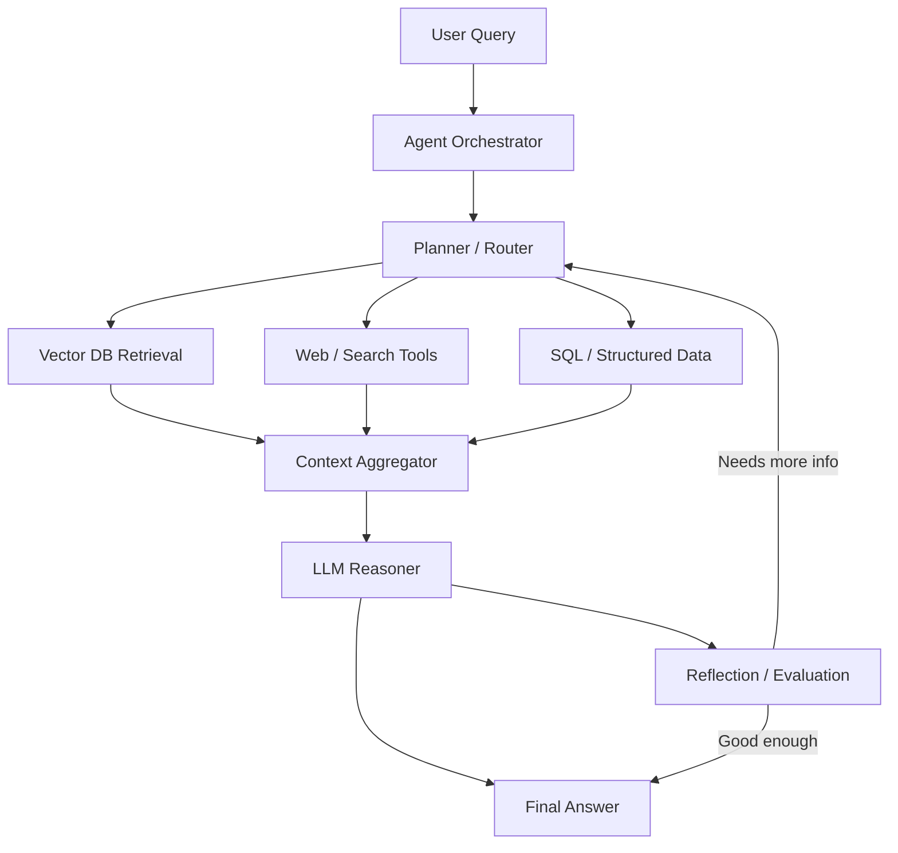
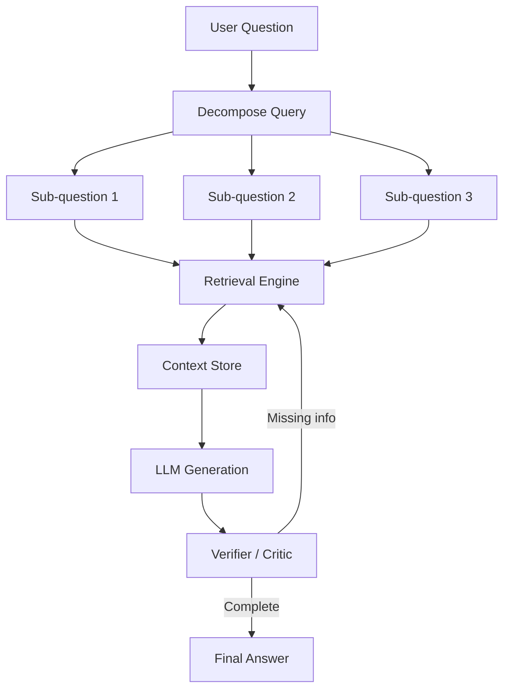
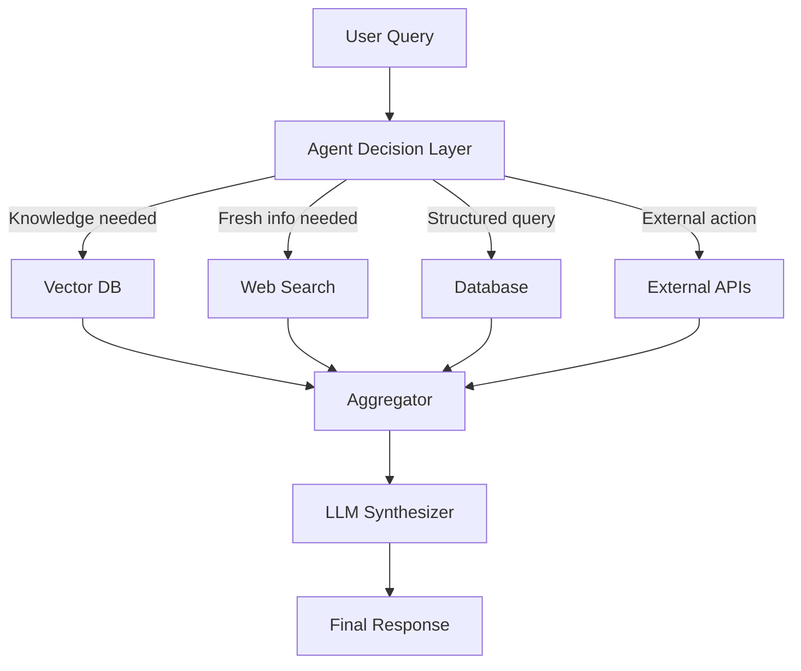
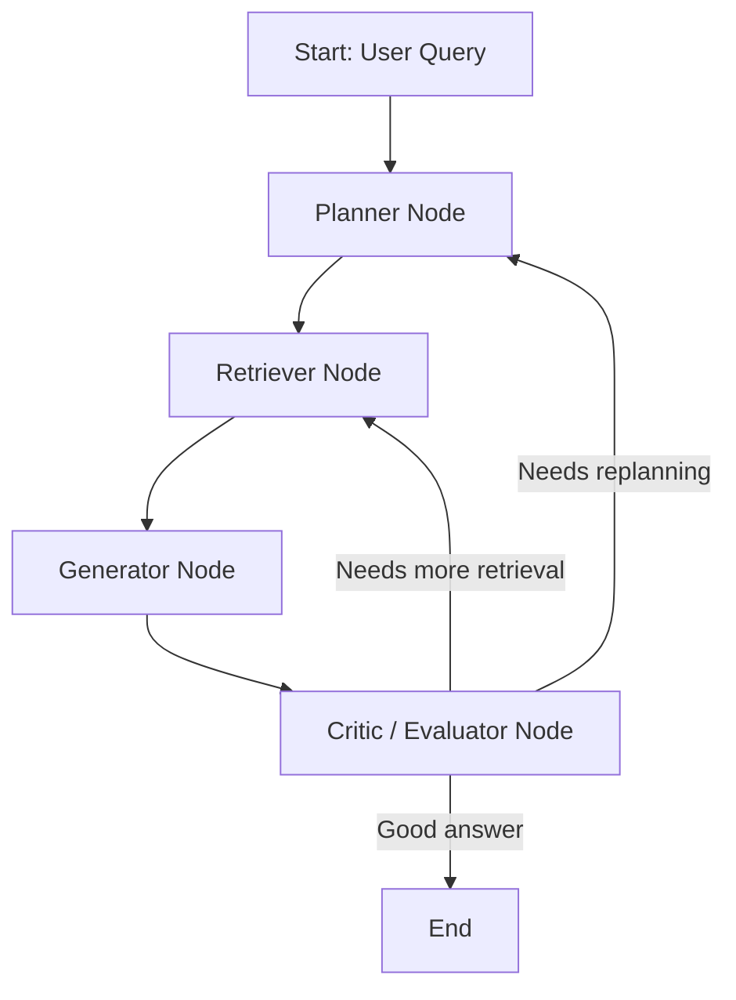

# Agentic AI RAG Patterns, Reference Architecture, and Implementation Guide

## 1. Introduction

Retrieval-Augmented Generation (RAG) in agentic AI systems extends beyond simple retrieval pipelines. Instead of passively retrieving context, agents actively decide *when*, *what*, and *how* to retrieve information, often iterating across reasoning, planning, and tool usage.

This document summarizes:

1. Key RAG patterns in agentic AI
2. A reference architecture
3. Implementation approaches using LangChain, LlamaIndex, and custom agents

---

# 2. RAG Patterns in Agentic AI

## 2.1 Classic Single-Step RAG

**Flow:**
User Query → Retrieve Top-K Documents → LLM Response

* Simple and widely used baseline
* No reasoning or iteration
* Suitable for factual Q&A

---

## 2.2 Iterative RAG (Looped Retrieval)

**Flow:**
Query → Retrieve → Reason → Decide if more retrieval is needed → Repeat

* Adds feedback loop
* Improves coverage for ambiguous queries

---

## 2.3 Multi-Hop RAG

**Flow:**
Question → Retrieve Step 1 → Extract Intermediate Fact → Retrieve Step 2 → Final Answer

* Supports reasoning across multiple documents
* Common in research systems

---

## 2.4 Query Decomposition RAG (Chain-of-Questions)

**Flow:**
Complex Query → Decompose into Sub-Questions → Retrieve per sub-question → Combine

* Improves performance on composite queries
* Example: comparison, planning, diagnostics

---

## 2.5 Plan-and-Execute RAG

**Flow:**
Plan → Retrieve per step → Execute → Synthesize

* Agent builds explicit strategy before retrieval
* Strong for autonomous assistants

---

## 2.6 Tool-Augmented RAG

**Flow:**
Agent → Decide tool (Vector DB / Web / SQL / API) → Retrieve → Reason

* Retrieval becomes one of many tools
* Common in enterprise agents

---

## 2.7 Self-RAG / Reflective RAG

**Flow:**
Retrieve → Generate → Evaluate → Retrieve again if needed

* Improves factual grounding
* Reduces hallucination

---

## 2.8 Adaptive Retrieval RAG

* Dynamically adjusts retrieval depth (top-k)
* Chooses strategy based on query complexity

---

## 2.9 Memory-Augmented RAG

* Combines:

  * Short-term conversational memory
  * Long-term vector memory

* Agent decides whether knowledge already exists in memory

---

## 2.10 Hierarchical RAG

**Flow:**
Document-level retrieval → Section-level retrieval → Chunk-level retrieval → Answer

* Efficient for large enterprise corpora

---

## 2.11 Critique-and-Refine RAG

**Flow:**
Draft Answer → Critique → Retrieve missing info → Rewrite

* Similar to Chain-of-Verification + Self-Refine

---

## 2.12 Multi-Agent RAG

Roles:

* Retriever Agent

* Reasoner Agent

* Critic Agent

* Synthesizer Agent

* Distributed intelligence system

---

# 3. Reference Architecture for Agentic RAG

## 3.1 High-Level Architecture (Mermaid Diagrams)

### 3.1.1 End-to-End Agentic RAG Flow



---

### 3.1.2 Iterative RAG Agent Loop



---

### 3.1.3 Tool-Augmented Agent Routing



---

## 3.2 Key Components

### 1. Agent Orchestrator

* Decides retrieval strategy
* Handles planning & decomposition

### 2. Retrieval Layer

* Vector DB (FAISS, Pinecone, Weaviate)
* Web search APIs
* SQL databases

### 3. Context Aggregator

* Merges multi-source retrieval results
* Deduplicates and ranks context

### 4. LLM Reasoner

* Generates final response
* Performs reasoning over retrieved context

### 5. Reflection Layer

* Evaluates correctness
* Triggers additional retrieval if needed

---

# 4. Implementation Approaches

## 4.1 LangChain Implementation

### Core Concepts

* Chains (RAG pipelines)
* Agents (tool selection)
* Memory modules

### Example Pattern

```python
from langchain.agents import initialize_agent, Tool
from langchain.chains import RetrievalQA

retriever = vectorstore.as_retriever()
qa_chain = RetrievalQA.from_chain_type(llm, retriever=retriever)

tools = [
    Tool(name="VectorRAG", func=qa_chain.run, description="Document QA"),
    Tool(name="WebSearch", func=search.run, description="Web search")
]

agent = initialize_agent(tools, llm, agent="zero-shot-react-description")

response = agent.run("Explain multi-hop reasoning in RAG")
```

### Key Strengths

* Mature agent framework
* Easy tool integration
* Good for production pipelines

---

## 4.2 LlamaIndex Implementation

### Core Concepts

* Index-based retrieval
* Query Engines
* Composable graphs

### Example Pattern

```python
from llama_index.core import VectorStoreIndex

index = VectorStoreIndex.from_documents(documents)
query_engine = index.as_query_engine()

response = query_engine.query("What is multi-hop RAG?")
```

### Advanced Pattern (Agentic)

* RouterQueryEngine
* Sub-question decomposition
* Multi-index routing

### Strengths

* Strong RAG-first design
* Excellent indexing abstractions
* Good for knowledge-heavy apps

---

## 4.3 Custom Agent Implementation

### Minimal Architecture

```python
class Agent:
    def plan(self, query):
        return decompose(query)

    def retrieve(self, subquery):
        return vector_db.search(subquery)

    def reason(self, context):
        return llm.generate(context)

    def run(self, query):
        steps = self.plan(query)
        context = []
        
        for s in steps:
            context.extend(self.retrieve(s))
        
        return self.reason(context)
```

### Adding Reflection

```python
def reflect(self, answer, context):
    critique = llm.evaluate(answer, context)
    if critique == "insufficient":
        new_query = refine_query(answer)
        return self.run(new_query)
    return answer
```

### Strengths

* Full control
* Highly customizable
* Suitable for research/production hybrid systems

---

## 4.4 LangGraph for Agentic RAG

LangGraph is a graph-based orchestration framework built on top of LangChain, designed specifically for **stateful, cyclical, and agentic workflows**.

### Why LangGraph matters for RAG

Unlike LangChain (which is mostly linear), LangGraph enables:

* Loops (critical for iterative RAG)
* State tracking across steps
* Conditional routing (planner/critic loops)
* Multi-agent collaboration patterns

---

### LangGraph RAG Execution Model



---

### Example LangGraph-style Flow (Conceptual)

```python
# Pseudocode structure

state = {
    "query": "",
    "context": [],
    "answer": "",
    "iterations": 0
}

def planner(state):
    return decomposed_queries(state["query"])


def retriever(state):
    docs = vector_db.search(state["query"])
    state["context"].extend(docs)
    return state


def generator(state):
    state["answer"] = llm.generate(state["context"])
    return state


def critic(state):
    if not is_sufficient(state["answer"]):
        state["query"] = refine_query(state["answer"])
        return "retrieve"
    return "end"
```

---

### LangGraph vs LangChain in RAG Context

| Feature              | LangChain     | LangGraph           |
| -------------------- | ------------- | ------------------- |
| Flow type            | Linear chains | Graph + cycles      |
| State handling       | Limited       | Native              |
| Multi-step reasoning | Hard          | Natural             |
| Reflection loops     | Complex       | First-class support |
| Agent systems        | Basic         | Advanced            |

---

### Recommendation

* Use **LangChain** for simple retrieval QA systems
* Use **LangGraph** for agentic RAG systems with planning, reflection, and multi-step reasoning

---

# 5. Summary

Agentic RAG systems evolve traditional retrieval into a **multi-step reasoning and decision system**.

Key takeaways:

* Retrieval is no longer passive
* Agents decide retrieval strategy dynamically
* Reflection improves accuracy
* Multi-tool systems outperform single-vector RAG

---

# 6. Optional Extensions

* Graph-based RAG (knowledge graphs)
* Hybrid symbolic + neural retrieval
* Long-term agent memory systems
* Multi-agent orchestration frameworks
