# RAG Architectural Patterns (Retrieval-Augmented Generation)

This document summarizes major Retrieval-Augmented Generation (RAG) architectural patterns, from basic pipelines to advanced agentic systems, including diagrams and a design decision framework.

---

# 1. Naive (Basic) RAG

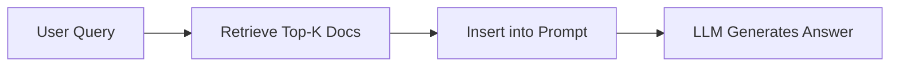

**Key Traits:**

* Single retrieval step
* No query refinement
* Fast but noisy

---

# 2. Dense / Semantic RAG

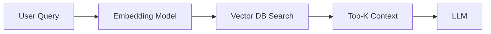

**Key Traits:**

* Semantic search using embeddings
* Better recall than keyword search

---

# 3. Hybrid RAG

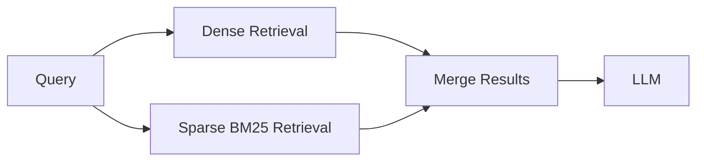

**Key Traits:**

* Combines keyword + semantic search
* More robust retrieval

---

# 4. Rerank-Enhanced RAG

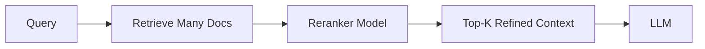

**Key Traits:**

* High precision retrieval
* Cross-encoder or LLM reranking

---

# 5. Multi-Hop RAG

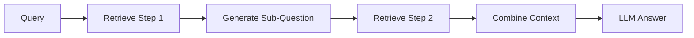

**Key Traits:**

* Multi-step reasoning
* Iterative retrieval

---

# 6. Query-Rewriting RAG

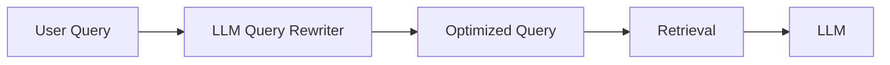

**Key Traits:**

* Improves retrieval quality
* Expands/clarifies queries

---

# 7. Hierarchical / Contextual RAG

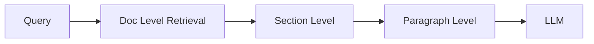

**Key Traits:**

* Multi-granular retrieval
* Efficient context usage

---

# 8. Graph RAG

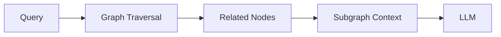

**Key Traits:**

* Knowledge graph-based retrieval
* Strong for relationships

---

# 9. Agentic RAG

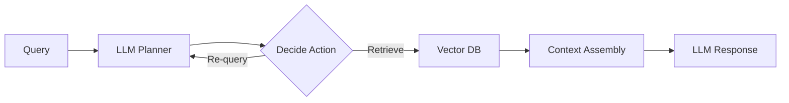

**Key Traits:**

* Autonomous decision-making
* Iterative reasoning loops

---

# 10. Tool-Augmented RAG

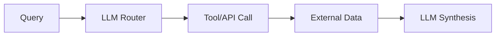

**Key Traits:**

* Integrates APIs, DBs, web tools
* Beyond document retrieval

---

# 11. Self-Reflective / Corrective RAG

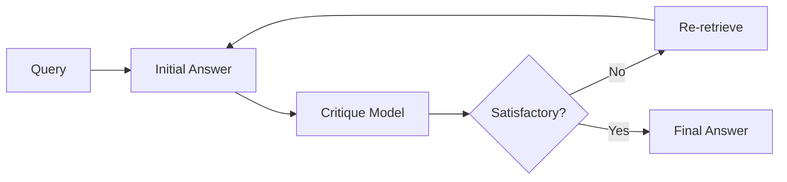

**Key Traits:**

* Self-evaluation loop
* Reduces hallucinations

---

# 12. Multimodal RAG

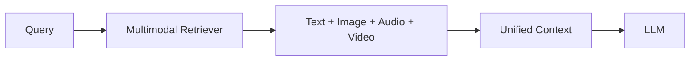

**Key Traits:**

* Cross-modal retrieval
* Rich data understanding

---

# 13. Agentic + Tool + RAG Hybrid

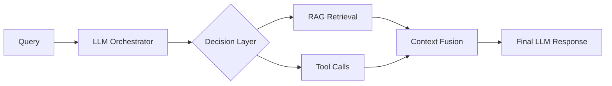

**Key Traits:**

* Most advanced architecture
* Combines tools + retrieval + reasoning

---

# RAG Design Decision Framework

Choosing the right RAG architecture depends on four dimensions:

---

## 1. Query Complexity

* Simple factual queries → Naive / Dense RAG
* Multi-step reasoning → Multi-Hop / Agentic RAG
* Relationship-heavy queries → Graph RAG

---

## 2. Data Type

* Text only → Dense / Hybrid RAG
* Structured + relational → Graph RAG
* Mixed media → Multimodal RAG

---

## 3. Accuracy vs Latency Tradeoff

| Goal             | Recommended Pattern |
| ---------------- | ------------------- |
| Lowest latency   | Naive RAG           |
| Balanced         | Hybrid + Rerank     |
| Highest accuracy | Agentic / Multi-hop |

---

## 4. Tool Requirements

* No external tools → Standard RAG
* APIs / DBs needed → Tool-Augmented RAG
* Complex workflows → Agentic + Tool Hybrid

---

## Practical Recommendation Map

* **Startups / MVPs:** Naive → Hybrid RAG
* **Enterprise search:** Hybrid + Rerank + Query Rewrite
* **AI agents:** Agentic + Tool + RAG
* **Knowledge graphs:** Graph RAG
* **Advanced assistants:** Multimodal + Agentic RAG

---

## Key Insight

Most production systems today are **hybrids**, combining multiple RAG patterns rather than relying on a single architecture.

---

# End of Document
